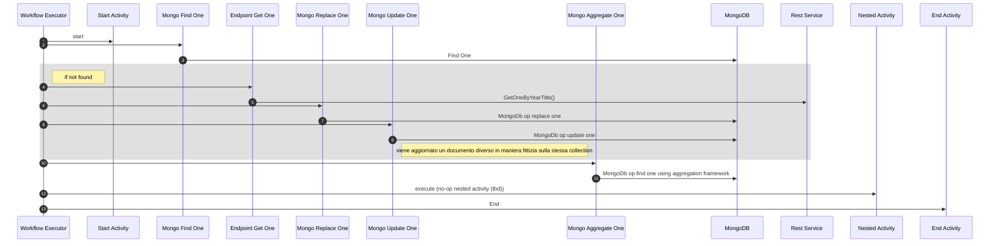

# Esecuzione di una orchestrazione

```shell
./tpm-chorus-cli orchestration \
      --orc orchestration-examples/movies \
      --req orchestration-examples/movies-orchestration-request.yaml \
      --cfg orchestration-examples/orchestrations-env-config.yaml
```

| Orchestrazione |                                                                                                             |
|----------------|-------------------------------------------------------------------------------------------------------------|
| --orc          | path relativo dove si trovano le configurazioni della orchestrazione                                        |
| --req          | definizione della richiesta in  formato yaml. La proprietà body che definisce il payload e' in formato json |
| --cfg          | configurazione delle metriche e dei linked services.                                                        |


## Struttura orchestrazione di esempio

### Body della chiamata

Cio' che viene usato e' l'elemento chiave. Il corpo non viene usato. Riportato come non rilevante per completezza.
(nota: nel caso di tpm-rhapsody i messaggi in ingresso vengono riportati ad un singolo body strutturato con le proprietà `key` e `body`)
```json
{
  "key": {
    "year": 1939,
    "title": "The Wizard of Oz"
  },
  "body": {
    "note": "not relevant"
  }
}
```

